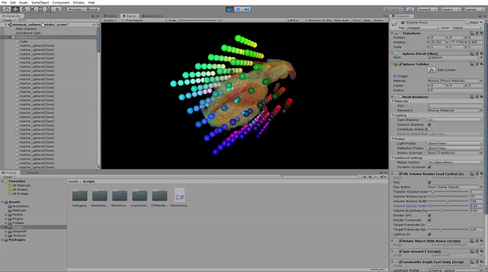

# VtkToUnity Plugin and Example

This is a plugin developed by the 3D Heart project (http://www.3dheart.co.uk/) to enable VTK (https://vtk.org/) OpenGL rendering within a Unity (https://unity.com/) application. It is especially targets volume rendering or medical images, for example Computed Tomography (CT) or Magnetic Resonance Imaging (MRI).



If you use this software, please kindly cite our work:

* [Gavin Wheeler, Shujie Deng, Nicolas Toussaint, Kuberan Pushparajah, Julia A. Schnabel, John M. Simpson, and Alberto Gomez. *"Virtual interaction and visualisation of 3D medical imaging data with VTK and Unity."* Healthcare technology letters 5, no. 5 (2018): 148-153.](https://ieeexplore.ieee.org/abstract/document/8527762)


### Building the plugin and running the example

1. Clone or download this repository to your hard drive. In Windows 10, with [git](https://git-scm.com/download/win) installed, open a `git bash` terminal, navigate to your folder of choice and run

```bash
$ git clone https://gitlab.com/3dheart_public/vtktounity.git
```

or using ssh

```bash
$ git clone git@gitlab.com:3dheart_public/vtktounity.git
```

2. Pull the pre-built VtkToUnity submodule

```bash
$ cd vtktounity
$ git submodule update --init
```

3. Run the example
	* Open the Unity project folder ['VtkToUnityExample'](VtkToUnityExample#vtktounity-example) in Unity
	* Example volume data is provided, and you can also use your own


### Example data

We supply example sample data from a cardiac phantom, available in the folder `\VtkToUnityExample\Data`. You can also use your own data or  download DICOM data from here:

[http://www.pcir.org/](http://www.pcir.org/)

Download some example DICOM data and unzip it. To then load the data into our application:
1. In the `Project` tab, click on `Assets`
2. Double click on `minimal_volume_render_scene.unity`. The scene will load.
3. In the `Hierarchy` panel, select the `StaticSceneData` object
4. In the object inspector view, set the path to the folder where the data is. Currently, the data can be in plain DICOM, mhd/raw, or mhd formats.
5. Press the 'play' button to launch the game

**Troubleshooting:** you will see some spheres and a rendered volume. If you can't see the rendered volume, this is most likely due to the window width/level settings. You can adjust these interactively by selecting `VolumeProxy` from the Hierarchy view and on the inspector panel, under `vtk Volume Render Load Control`, changing the `Volume Window Level` and `Volume Window Width`.


### Supported platforms, and Unity and VTK versions

* OS
	* Windows 10
* Unity
	* Release using Unity 2019.2.0f1
	* (Also used successfully with Unity 2018.X)
* VTK
	* 8.1.0
* VR
	* HTC Vive and SteamVR


### Building the plugin

You may build the VtkToUnity plugin yourself, e.g. to extend the code and add new functions:

1. Build a modified version of VTK
	* Follow the [instructions](VtkModifications#vtktounity-plugin-vtk-modifications) in the 'VtkModifications' folder
2. Build the plugin
	* Follow the [instructions](VtkToUnityPlugin#vtktounity-plugin-build-instructions) in the 'VtkToUnityPlugin' folder

This will copy the write the updated plugin you build over the one pulled from gitlab.


### What license is the plugin and example shipped under?

The license is MIT.


### Native Rendering Plugins

* This work is based upon Unity's C++ native rendering plugin example, see [native plugin interface manual](http://docs.unity3d.com/Manual/NativePluginInterface.html).

### Acknowledgment

This work was supported by the NIHR i4i funded 3D Heart project [II-LA-0716-20001]. This work was also supported by the Wellcome/EPSRC Centre for Medical Engineering [WT 203148/Z/16/Z]. The research was funded/supported by the National Institute for Health Research (NIHR) Biomedical Research Centre based at Guy's and St Thomas' NHS Foundation Trust and King's College London and supported by the NIHR Clinical Research Facility (CRF) at Guy's and St Thomas'. The views expressed are those of the author(s) and not necessarily those of the NHS, the NIHR or the Department of Health.


